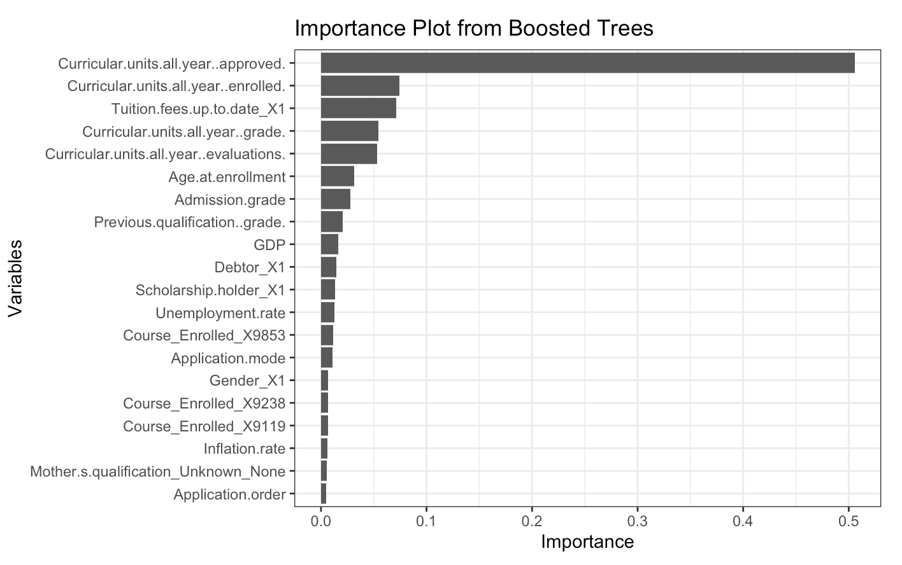

\newpage

```{r setup, include=FALSE}
knitr::opts_chunk$set(echo = TRUE)
```


```{r, include=FALSE}
library(readr)
student_data <- read_csv('https://archive.ics.uci.edu/static/public/697/data.csv')

library(dplyr)
student_data <- mutate(student_data, `Marital Status` = as.factor(`Marital Status`))
student_data <- mutate(student_data, `Displaced` = as.factor(`Displaced`))
student_data <- mutate(student_data, `Daytime/evening attendance` = as.factor(`Daytime/evening attendance`))
student_data <- mutate(student_data, `Educational special needs` = as.factor(`Educational special needs`))
student_data <- mutate(student_data, `Tuition fees up to date` = as.factor(`Tuition fees up to date`))
student_data <- mutate(student_data, `Gender` = as.factor(`Gender`))
student_data <- mutate(student_data, `Scholarship holder` = as.factor(`Scholarship holder`))
student_data <- mutate(student_data, `Mother's qualification` = as.factor(`Mother's qualification`))
student_data <- mutate(student_data, `Father's qualification` = as.factor(`Father's qualification`))
student_data <- mutate(student_data, `Previous qualification` = as.factor(`Previous qualification`))

names(student_data)[names(student_data) == "Course"] <- "Course_Enrolled"
names(student_data)[names(student_data) == "Nacionality"] <- "Nationality"

student_data <- mutate(student_data, `Nationality` = as.factor(`Nationality`))
student_data <- mutate(student_data, `Course_Enrolled` = as.factor(`Course_Enrolled`))
student_data <- mutate(student_data, `Mother's occupation` = as.factor(`Mother's occupation`))
student_data <- mutate(student_data, `Father's occupation` = as.factor(`Father's occupation`))
student_data <- mutate(student_data, `Debtor` = as.factor(`Debtor`))
student_data <- mutate(student_data, `International` = as.factor(`International`))

library(forcats)

student_data$`Mother's qualification` <- factor(student_data$`Mother's qualification`, levels = c(1, 2, 3, 4, 5, 6, 9, 10, 11, 12, 14, 18, 19, 22, 26, 27, 29, 30, 31, 33, 34, 35, 36, 37, 38, 39, 40, 41, 42, 43, 44))


## Collapse the levels into broader categories
student_data <- mutate(student_data, `Mother's qualification` = fct_collapse(`Mother's qualification`,
    Basic_Education = c("19", "26", "27", "37", "38"),
    Secondary_Education = c("1", "9", "12", "14", "18", "29", "30", "10", "11"),
    Higher_Education = c("2", "3", "4", "5", "6", "40", "41", "42", "43", "44"),
    Professional_Technical = c("22", "39"),
    Unknown_None = c("34", "35", "36", "31", "33")
))

levels(student_data$`Mother's qualification`)

student_data$`Father's qualification` <- factor(student_data$`Father's qualification`, levels = c(1, 2, 3, 4, 5, 6, 9, 10, 11, 12, 14, 18, 19, 22, 26, 27, 29, 30, 31, 33, 34, 35, 36, 37, 38, 39, 40, 41, 42, 43, 44))


## Collapse the levels into broader categories
student_data <- mutate(student_data, `Father's qualification` = fct_collapse(`Father's qualification`,
    Basic_Education = c("19", "26", "27", "37", "38"),
    Secondary_Education = c("1", "9", "12", "14", "18", "29", "30", "10", "11"),
    Higher_Education = c("2", "3", "4", "5", "6", "40", "41", "42", "43", "44"),
    Professional_Technical = c("22", "39"),
    Unknown_None = c("34", "35", "36", "31", "33")
))

levels(student_data$`Father's qualification`)

student_data$`Previous qualification` <- factor(student_data$`Previous qualification`, levels = c(1, 2, 3, 4, 5, 6, 9, 10, 12, 14, 15, 19, 38, 39, 40, 42, 43))

## Collapse the factor levels into broader categories using forcats::fct_collapse
student_data <- mutate(student_data, `Previous qualification` = fct_collapse(`Previous qualification`,
    Basic_Education = c("19", "38"),
    Secondary_Education = c("1", "9", "10", "12", "14", "15"),
    Higher_Education = c("2", "3", "4", "5", "6", "40", "43"),
    Professional_Technical = c("39", "42")
))

## Print the new levels to verify the changes
levels(student_data$`Previous qualification`)

student_data$`Mother's occupation` <- factor(student_data$`Mother's occupation`, levels = c(0, 1, 2, 3, 4, 5, 6, 7, 8, 9, 10, 90, 99, 122, 123, 125, 131, 132, 134, 141, 143, 144, 151, 152, 153, 171, 173, 175, 191, 192, 193, 194))

## Collapse the levels into broader categories
student_data <- mutate(student_data, `Mother's occupation` = fct_collapse(`Mother's occupation`,
    Student = "0",
    High_Level_Professionals = c("1", "2", "122", "123", "125"),
    Intermediate_Professionals = c("3", "131", "132", "134"),
    Administrative_Staff = c("4", "141", "143", "144"),
    Service_Workers = c("5", "151", "152", "153", "191"),
    Skilled_Workers = c("6", "7", "171", "173", "175"),
    Operators_Assembly_Workers = c("8"),
    Unskilled_Workers = c("9", "192", "193", "194"),
    Armed_Forces = "10",
    Other_Unknown = c("90", "99")
))

student_data$`Father's occupation` <- factor(student_data$`Father's occupation`, levels = c(0, 1, 2, 3, 4, 5, 6, 7, 8, 9, 10, 90, 99, 122, 123, 125, 131, 132, 134, 141, 143, 144, 151, 152, 153, 171, 173, 175, 191, 192, 193, 194))

## Collapse the levels into broader categories
student_data <- mutate(student_data, `Father's occupation` = fct_collapse(`Father's occupation`,
    Student = c("0"),
    High_Level_Professionals = c("1", "2", "122", "123", "125"),
    Intermediate_Professionals = c("3", "131", "132", "134"),
    Administrative_Staff = c("4", "141", "143", "144"),
    Service_Workers = c("5", "151", "152", "153", "191"),
    Skilled_Workers = c("6", "7", "171", "173", "175"),
    Operators_Assembly_Workers = c("8"),
    Unskilled_Workers = c("9", "192", "193", "194"),
    Armed_Forces = "10",
    Other_Unknown = c("90", "99")
))

student_data$`Marital Status` <- factor(student_data$`Marital Status`, levels = c("1", "2", "3", "4", "5", "6"))

student_data$`Marital Status` <- fct_recode(student_data$`Marital Status`,
                                            "Single" = "1",
                                            "Married" = "2",
                                            "Other" = "3",  
                                            "Other" = "4",  
                                            "Other" = "5",  
                                            "Other" = "6")

student_data <- student_data %>%
  mutate(
    `Curricular units all year (enrolled)` = (`Curricular units 1st sem (enrolled)` + `Curricular units 2nd sem (enrolled)`) / 2,
    `Curricular units all year (evaluations)` = (`Curricular units 1st sem (evaluations)` + `Curricular units 2nd sem (evaluations)`) / 2,
    `Curricular units all year (approved)` = (`Curricular units 1st sem (approved)` + `Curricular units 2nd sem (approved)`) / 2,
    `Curricular units all year (grade)` = (`Curricular units 1st sem (grade)` + `Curricular units 2nd sem (grade)`) / 2
  )

## Remove semesterly data - Don't run twice
student_data <- student_data[,-c(22,23,24,25,26,27,28,29,30,31,32,33)]

student_data <- na.omit(student_data)

names(student_data) <- make.names(names(student_data))
student_data$Target <- factor(student_data$Target)
```


# Introduction

The transition from secondary to higher education often poses significant challenges for students, leading to academic difficulties and dropout. This phenomenon critically affects students' future prospects and institutions' reputations and financial stability. Our research investigates the factors influencing student outcomes in higher education, utilizing statistical learning methods to predict student outcomes based on variables such as demographic, socio-economic, and academic information. Our research question is: “What factors are the most predictive of student graduate outcomes in higher education?”

Previous studies primarily focus on predicting academic success using statistical methods. Beaulac and Roosenthal used random forests to predict whether students will complete their program based solely on course grades in college, with 78.84% accuracy.[^1] In addition, Martins et al., whose dataset we will use, achieved a higher accuracy rate for boosting algorithms (73%) than random forests (72%), but were yet to incorporate student performance in their first semesters.[^2] Our research will take a step further by adding in early college performance predictors and significantly more observations into our analysis.

[^1]: Cédric Beaulac and Jeffrey S. Rosenthal, "Predicting University Students’ Academic Success and Major Using Random Forests," in *Research in Higher Education* 60, no.7 (2019): 1048-64, doi.org/10.1007/s11162-019-09546-y.
[^2]: Mónica V. Martins et al., "Early Prediction of student’s Performance in Higher Education: A Case Study," in *Trends and Applications in Information Systems and Technologies* 1 (2021): 166-75, doi.org/10.1007/978-3-030-72657-7_16.

# Methods

**Dataset Description**

The dataset of this study was sourced from the UC Irvine Machine Learning Repository, containing records from the Polytechnic Institute of Portalegre, Portugal. The dataset spans the school years 2008-09 and 2018-19, consisting of 4424 student records across various undergraduate degrees. The data features 36 predictors and a categorical response variable with three levels of student outcomes: `dropout`, `enrolled`, and `graduate`.

**Data Processing**

The data was loaded into RStudio using UCI's URL. Initial data wrangling involved checking for missing values (none found) and recoding categorical variables from numerical to factor types. Further modifications included renaming variables and collapsing the levels of complex categorical variables like parental qualifications and occupations into more general categories for analytical and modeling purposes.


# Exploratory Data Analysis

To address the research question of which factors most effectively predict student graduation outcomes in higher education, we aim to investigate the relationship between each potentially significant predictor and our response variable. Thus, the goal of this exploratory data analysis is to familiarize ourselves with the data by visualizing how our different variables interact, potentially forming assumptions about the most predictive features of students' higher education outcomes.

During this phase, we utilized both visual and statistical methods. For quantitative predictors, we applied various techniques such as computing five-number summaries and examining histograms to identify possible skewness. To check for multicollinearity, we conducted a correlation analysis, which ultimately led to the combination of early college performance metrics from semester-based to yearly, reducing redundancy and enhancing the model's interpretability.

For qualitative predictors, we visualized data to assess the relevance between these variables and the response variable, focusing on elements likely to impact student outcomes such as parental background, prior academic achievements, and initial college performance. Below are some noteworthy graphs of selected predictors whose association with students' outcomes is strong.

```{r, include=FALSE}
library(ggplot2)
library(gridExtra)
```

```{r echo = F}
# Define the plots
plot1 <- ggplot(student_data, aes(x = Target, y = Curricular.units.all.year..grade., fill = Target)) + 
  geom_boxplot() + theme_bw() +
  labs(title = "Number of curricular units (grade) by Target", x = "Target", y = "Curricular units all year (grade)") +
  theme(
    plot.title = element_text(size = 10),  
    axis.title = element_text(size = 8),   
    axis.text = element_text(size = 6)     
  )

plot2 <- ggplot(student_data, aes(x = Target, y = Curricular.units.all.year..approved., fill = Target)) + 
  geom_boxplot() + theme_bw() +
  labs(title = "Number of curricular units (approved) by Target", x = "Target", y = "Curricular units all year (approved)") +
  theme(
    plot.title = element_text(size = 9),  
    axis.title = element_text(size = 8),   
    axis.text = element_text(size = 6)     
  )

plot3 <- ggplot(student_data, aes(x = Debtor, fill = Target)) +
  geom_bar(position = "dodge") + 
  labs(x = "Debtor", y = "Count", title = "Debtor by Target Categories") +
  theme_minimal() +
  theme(axis.text.x = element_text(angle = 45, hjust = 1)) +
  theme(
    plot.title = element_text(size = 10),  
    axis.title = element_text(size = 8),   
    axis.text = element_text(size = 6)     
  ) + theme_bw()

plot4 <- ggplot(student_data, aes(x = Scholarship.holder, fill = Target)) +
  geom_bar(position = "dodge") + theme_bw() +
  labs(x = "Scholarship holder", y = "Count", title = "Scholarship holder by Target Categories") +
  theme_minimal() +
  theme(axis.text.x = element_text(angle = 45, hjust = 1)) +
  theme(
    plot.title = element_text(size = 10),  
    axis.title = element_text(size = 8),   
    axis.text = element_text(size = 6)     
  ) + theme_bw()

# Arrange the plots in a 2 x 2 grid
grid.arrange(plot1, plot2, plot3, plot4, nrow = 2, ncol = 2)
```


Through detailed analysis of each potential predictor and students' outcomes, we have developed strong confidence that there may be very strong predictors among our features. We then continue with model building to more accurately identify those.

# Results

For the purpose of our study, we will use two classification models that are able to show the relative predictive power of the independent variables: random forests and boosted trees. Random forest is a tree-based model using ensemble methods. The random forest consists of many trees that are constructed using a random sample of predictors at each split. Random forest is suitable because it automatically performs feature selection. Another advantage of it is that the `randomForest` package allows us to glimpse into the importance of the predictors in our classification. Below is the importance plot of a random forest model with 250 trees and 5 predictors considered at each split.

```{r, include=FALSE}
library(rsample)
set.seed(2024)
my_split <- initial_split(student_data, prop = 0.8, strata = Target)
train_student <- training(my_split)
test_student <- testing(my_split)
```

```{r, include=FALSE}
## Build model
library(randomForest)
set.seed(2024)
rf_mod <- randomForest(Target ~., train_student, ntree = 250, mtry = 5)

## Importance Plot
imp_rf <- as.data.frame(importance(rf_mod))
imp_rf$names <- rownames(imp_rf)
rownames(imp_rf) <- NULL
imp_rf <- imp_rf %>% arrange(desc(MeanDecreaseGini))
imp_rf <- imp_rf[1:20,]
```

```{r, echo=FALSE, message=FALSE, warning=FALSE, fig.width=6.5, fig.height=3.8}
library(ggplot2)
ggplot(imp_rf, aes(y = reorder(names,MeanDecreaseGini), x = MeanDecreaseGini)) + geom_col() + theme_bw() + labs(x="Mean decrease in Gini coefficient", y="Variables") + ggtitle("Importance Plot from Random Forest")
```

As can be seen, the variables relating to current academic standing and course enrolled in college are the most significant in assessing a student's chance of dropping out. Specifically, the average number of curricular credits approved per semester in the first year was the most predictive, followed by student's average grade in the first year and the course they enrolled (i.e., the major/concentration at the Portuguese institution). Other variables in the top 10 most important include father's and mother's occupation, whether the tuition fees were paid up to date, and admission grade. For reference, the cross-validated accuracy rate of this random forest is 77.48%, which is roughly equal to the reviewed literature's findings, which ranges between 70% and 80%. That said, we are primarily concerned with the variable importance.

```{r, echo=FALSE, message=FALSE, warning=FALSE}
## Folds
set.seed(2024)
my_folds <- vfold_cv(student_data, strata = Target, v=5)

## Create new function
library(yardstick)
get_rf_accuracy <- function(split){
  my_train <- analysis(split)
  my_test <- assessment(split)
  set.seed(2024)
  my_rf <- randomForest(Target ~., my_train, ntree = 250, mtry = 5)
  my_results <- data.frame(obs = my_test$Target,
                         preds = predict(my_rf, my_test))
  my_acc <- accuracy(my_results, truth = obs, estimate = preds)
  as.numeric(my_acc[1,3])
}

## Mapping
library(purrr)
mean(map_dbl(my_folds$splits, get_rf_accuracy))
```

We then performed boosted trees using the `tidymodels` framework and `xgboost` engine. Boosted trees are another tree-based ensemble method but with learning feature. That is, each tree is built in the consideration of the previous tree's error. Introducing learning rate into the model has the potential to increase our accuracy rate significantly. Moreover, boosted trees can also give us information on the importance of predictors. Below is the importance plot of a boosting model with 250 trees, a tree depth of 5, a minimum node size of 10 observations, and learning rate of 0.4, which are our best parameters. The plot was generated using the `vip` package, from a separate .Rmd file. Boosting algorithms are computationally intensive, so we used Grinnell's computer instead of the server.



Note that the measurement unit of variable importance is not mean decrease in Gini index, but rather the Shapley value due our code `vip()`.[^3] As shown above, 4 out of 5 most important predictors are academic data in the first year of college, with the average number of credits approved per semester stood out remarkably. There is a significant similarity between random forest and boosted trees in terms of the 10 best variables (7 matches out of 10). However, boosted trees enlisted whether the student's family was in debt (`Debtor`) and previous qualification grade as important. For reference, the cross-validated accuracy rate is 77.82%, which is minimally higher than that of our random forest model.

[^3]: The Comprehensive R Archive Network, *vip: Variable Importance Plots*, https://cran.r-project.org/web/packages/vip/index.html

# Discussion

**Conclusion**

Our research aimed to identify the most predictive indicators of college dropouts and has successfully highlighted metrics of first-year performance, such as the number of curricular units approved, enrolled, grades, and evaluations. Additionally, factors like tuition fees payment status and age at enrollment also play a role. Notably, the average number of credits approved per semester had a substantially higher predictive value compared to other factors, indicating its crucial role in predicting potential dropouts.

Our findings significantly build upon Martins et al. (2021), confirming that incorporating metrics of first-year college performance is crucial in identifying potential dropouts, as evidenced by the importance plot. Moreover, the accuracy of our boosted tree models, approximately 78%, surpasses the 73% achieved by the authors' models that did not include first-year performance, further proving the predictive power of early performance metrics in higher education.

**Limitations**

Random forests and boosted trees are computationally intensive models, requiring significant resources and time. Additionally, our models may not be optimized fully due to potentially non-optimal parameter settings.

Our study is also limited to the data from the Polytechnic Institute of Portalegre, Portugal, which may include confounding variables that affect its generalizability to broader higher education contexts.

Another challenge is class imbalance for the response variable, in which the number of records is widely disparate among the classes. This is often the case in our context because it is likely that the minority of students underperform and drop out. Class imbalance may lead to a higher error in identifying dropouts, which is contrary to our research' implication for early academic intervention.

**Areas for Further Research**

Future research should explore more comprehensive data about students' first year, including aspects of their social life, to gain a fuller understanding of dropout predictors. Additionally, replicating this study at different institutions could help verify our findings and enhance the representativeness of the sample, ensuring broader applicability of the results.

\newpage

# Code Appendix

## Data Wrangling
```{r, eval=FALSE, echo=TRUE}
library(readr)
student_data <- read_csv('https://archive.ics.uci.edu/static/public/697/data.csv')

library(dplyr)
student_data <- student_data %>% mutate(`Marital Status` = as.factor(`Marital Status`),
                                        `Displaced` = as.factor(`Displaced`),
                                        `Daytime/evening attendance` = as.factor(`Daytime/evening attendance`),
                                        `Educational special needs` = as.factor(`Educational special needs`),
                                        `Tuition fees up to date` = as.factor(`Tuition fees up to date`),
                                        `Gender` = as.factor(`Gender`),
                                        `Scholarship holder` = as.factor(`Scholarship holder`),
                                        `Mother's qualification` = as.factor(`Mother's qualification`),
                                        `Father's qualification` = as.factor(`Father's qualification`),
                                        `Previous qualification` = as.factor(`Previous qualification`))

names(student_data)[names(student_data) == "Course"] <- "Course_Enrolled"
names(student_data)[names(student_data) == "Nacionality"] <- "Nationality"

student_data <- student_date %>% mutate(`Nationality` = as.factor(`Nationality`),
                                        `Course_Enrolled` = as.factor(`Course_Enrolled`),
                                        `Mother's occupation` = as.factor(`Mother's occupation`),
                                        `Father's occupation` = as.factor(`Father's occupation`),
                                        `Debtor` = as.factor(`Debtor`),
                                        `International` = as.factor(`International`))

library(forcats)

student_data$`Mother's qualification` <- factor(student_data$`Mother's qualification`, levels = c(1, 2, 3, 4, 5, 6, 9, 10, 11, 12, 14, 18, 19, 22, 26, 27, 29, 30, 31, 33, 34, 35, 36, 37, 38, 39, 40, 41, 42, 43, 44))


## Collapse the levels into broader categories
student_data <- mutate(student_data, `Mother's qualification` = fct_collapse(`Mother's qualification`,
    Basic_Education = c("19", "26", "27", "37", "38"),
    Secondary_Education = c("1", "9", "12", "14", "18", "29", "30", "10", "11"),
    Higher_Education = c("2", "3", "4", "5", "6", "40", "41", "42", "43", "44"),
    Professional_Technical = c("22", "39"),
    Unknown_None = c("34", "35", "36", "31", "33")
))

levels(student_data$`Mother's qualification`)

student_data$`Father's qualification` <- factor(student_data$`Father's qualification`, levels = c(1, 2, 3, 4, 5, 6, 9, 10, 11, 12, 14, 18, 19, 22, 26, 27, 29, 30, 31, 33, 34, 35, 36, 37, 38, 39, 40, 41, 42, 43, 44))


## Collapse the levels into broader categories
student_data <- mutate(student_data, `Father's qualification` = fct_collapse(`Father's qualification`,
    Basic_Education = c("19", "26", "27", "37", "38"),
    Secondary_Education = c("1", "9", "12", "14", "18", "29", "30", "10", "11"),
    Higher_Education = c("2", "3", "4", "5", "6", "40", "41", "42", "43", "44"),
    Professional_Technical = c("22", "39"),
    Unknown_None = c("34", "35", "36", "31", "33")
))

levels(student_data$`Father's qualification`)

student_data$`Previous qualification` <- factor(student_data$`Previous qualification`, levels = c(1, 2, 3, 4, 5, 6, 9, 10, 12, 14, 15, 19, 38, 39, 40, 42, 43))

## Collapse the factor levels into broader categories using forcats::fct_collapse
student_data <- mutate(student_data, `Previous qualification` = fct_collapse(`Previous qualification`,
    Basic_Education = c("19", "38"),
    Secondary_Education = c("1", "9", "10", "12", "14", "15"),
    Higher_Education = c("2", "3", "4", "5", "6", "40", "43"),
    Professional_Technical = c("39", "42")
))

## Print the new levels to verify the changes
levels(student_data$`Previous qualification`)

student_data$`Mother's occupation` <- factor(student_data$`Mother's occupation`, levels = c(0, 1, 2, 3, 4, 5, 6, 7, 8, 9, 10, 90, 99, 122, 123, 125, 131, 132, 134, 141, 143, 144, 151, 152, 153, 171, 173, 175, 191, 192, 193, 194))

## Collapse the levels into broader categories
student_data <- mutate(student_data, `Mother's occupation` = fct_collapse(`Mother's occupation`,
    Student = "0",
    High_Level_Professionals = c("1", "2", "122", "123", "125"),
    Intermediate_Professionals = c("3", "131", "132", "134"),
    Administrative_Staff = c("4", "141", "143", "144"),
    Service_Workers = c("5", "151", "152", "153", "191"),
    Skilled_Workers = c("6", "7", "171", "173", "175"),
    Operators_Assembly_Workers = c("8"),
    Unskilled_Workers = c("9", "192", "193", "194"),
    Armed_Forces = "10",
    Other_Unknown = c("90", "99")
))

student_data$`Father's occupation` <- factor(student_data$`Father's occupation`, levels = c(0, 1, 2, 3, 4, 5, 6, 7, 8, 9, 10, 90, 99, 122, 123, 125, 131, 132, 134, 141, 143, 144, 151, 152, 153, 171, 173, 175, 191, 192, 193, 194))

## Collapse the levels into broader categories
student_data <- mutate(student_data, `Father's occupation` = fct_collapse(`Father's occupation`,
    Student = c("0"),
    High_Level_Professionals = c("1", "2", "122", "123", "125"),
    Intermediate_Professionals = c("3", "131", "132", "134"),
    Administrative_Staff = c("4", "141", "143", "144"),
    Service_Workers = c("5", "151", "152", "153", "191"),
    Skilled_Workers = c("6", "7", "171", "173", "175"),
    Operators_Assembly_Workers = c("8"),
    Unskilled_Workers = c("9", "192", "193", "194"),
    Armed_Forces = "10",
    Other_Unknown = c("90", "99")
))

student_data$`Marital Status` <- factor(student_data$`Marital Status`, levels = c("1", "2", "3", "4", "5", "6"))

student_data$`Marital Status` <- fct_recode(student_data$`Marital Status`,
                                            "Single" = "1",
                                            "Married" = "2",
                                            "Other" = "3",  
                                            "Other" = "4",  
                                            "Other" = "5",  
                                            "Other" = "6")

student_data <- student_data %>%
  mutate(
    `Curricular units all year (enrolled)` = (`Curricular units 1st sem (enrolled)` + `Curricular units 2nd sem (enrolled)`) / 2,
    `Curricular units all year (evaluations)` = (`Curricular units 1st sem (evaluations)` + `Curricular units 2nd sem (evaluations)`) / 2,
    `Curricular units all year (approved)` = (`Curricular units 1st sem (approved)` + `Curricular units 2nd sem (approved)`) / 2,
    `Curricular units all year (grade)` = (`Curricular units 1st sem (grade)` + `Curricular units 2nd sem (grade)`) / 2
  )

## Remove semesterly data
student_data <- student_data[,-c(22,23,24,25,26,27,28,29,30,31,32,33)]

student_data <- na.omit(student_data)

names(student_data) <- make.names(names(student_data))
student_data$Target <- factor(student_data$Target)
```

## Exploratory Data Analysis

```{r, eval=FALSE, echo=TRUE}
library(ggplot2)
library(gridExtra)
## Define the plots
plot1 <- ggplot(student_data, aes(x = Target, y = Curricular.units.all.year..grade., fill = Target)) + 
  geom_boxplot() + theme_bw() +
  labs(title = "Number of curricular units (grade) by Target", x = "Target", y = "Curricular units all year (grade)") +
  theme(
    plot.title = element_text(size = 10),  
    axis.title = element_text(size = 8),   
    axis.text = element_text(size = 6)     
  )

plot2 <- ggplot(student_data, aes(x = Target, y = Curricular.units.all.year..approved., fill = Target)) + 
  geom_boxplot() + theme_bw() +
  labs(title = "Number of curricular units (approved) by Target", x = "Target", y = "Curricular units all year (approved)") +
  theme(
    plot.title = element_text(size = 9),  
    axis.title = element_text(size = 8),   
    axis.text = element_text(size = 6)     
  )

plot3 <- ggplot(student_data, aes(x = Debtor, fill = Target)) +
  geom_bar(position = "dodge") + 
  labs(x = "Debtor", y = "Count", title = "Debtor by Target Categories") +
  theme_minimal() +
  theme(axis.text.x = element_text(angle = 45, hjust = 1)) +
  theme(
    plot.title = element_text(size = 10),  
    axis.title = element_text(size = 8),   
    axis.text = element_text(size = 6)     
  ) + theme_bw()

plot4 <- ggplot(student_data, aes(x = Scholarship.holder, fill = Target)) +
  geom_bar(position = "dodge") + theme_bw() +
  labs(x = "Scholarship holder", y = "Count", title = "Scholarship holder by Target Categories") +
  theme_minimal() +
  theme(axis.text.x = element_text(angle = 45, hjust = 1)) +
  theme(
    plot.title = element_text(size = 10),  
    axis.title = element_text(size = 8),   
    axis.text = element_text(size = 6)     
  ) + theme_bw()

## Arrange the plots in a 2 x 2 grid
grid.arrange(plot1, plot2, plot3, plot4, nrow = 2, ncol = 2)
```

## Random forest

```{r, eval=FALSE, echo=TRUE}
## Folds
set.seed(2024)
my_folds <- vfold_cv(student_data, strata = Target, v=5)

## Create new function
library(yardstick)
get_rf_accuracy <- function(split){
  my_train <- analysis(split)
  my_test <- assessment(split)
  set.seed(2024)
  my_rf <- randomForest(Target ~., my_train, ntree = 250, mtry = 5)
  my_results <- data.frame(obs = my_test$Target,
                         preds = predict(my_rf, my_test))
  my_acc <- accuracy(my_results, truth = obs, estimate = preds)
  as.numeric(my_acc[1,3])
}

## Cross-validated accuracy
library(purrr)
mean(map_dbl(my_folds$splits, get_rf_accuracy))
```

```{r, eval=FALSE, echo=TRUE}
## Build model
library(randomForest)
set.seed(2024)
rf_mod <- randomForest(Target ~., train_student, ntree = 250, mtry = 5)

## Importance Plot
imp_rf <- as.data.frame(importance(rf_mod))
imp_rf$names <- rownames(imp_rf)
rownames(imp_rf) <- NULL
imp_rf <- imp_rf %>% arrange(desc(MeanDecreaseGini))
imp_rf <- imp_rf[1:20,]

ggplot(imp_rf, aes(y = reorder(names,MeanDecreaseGini), x = MeanDecreaseGini)) + geom_col() + theme_bw() + labs(x="Mean decrease in Gini coefficient", y="Variables") + ggtitle("Importance Plot from Random Forest")
```


## Boosted trees

The code is excerpted from XGBoost.Rmd, which is the file we ran in DASIL.

```{r, eval=FALSE, echo=TRUE}
library(tidymodels)

## Recipe
student_rec <- recipe(Target ~., data = train) %>% 
  step_novel(all_nominal()) %>% 
  step_dummy(all_nominal(), - all_outcomes())

## Model
boosted_mod <- boost_tree(
  trees = tune(),
  tree_depth = tune(), 
  min_n = tune(),
  learn_rate = tune()
) %>% 
  set_engine("xgboost") %>% 
  set_mode("classification")

## Build workflow  
xgb_wf <- workflow() %>% 
  add_model(boosted_mod) %>% 
  add_recipe(student_rec)

## Parameter grid
trees <- c(50, 100, 250)
tree_depth <- c(3, 5, 7)
min_n <- c(10)
learn_rate <- c(0.02, 0.04, 0.1)

xgb_grid <- crossing(trees, tree_depth, min_n, learn_rate)

## Folds
set.seed(2024)
boosted_folds <- vfold_cv(train, strata = Target, v = 4)
```

```{r, eval=FALSE, echo=TRUE}
## Run the model
require(xgboost)
my_time <- system.time(
xgb_res <- tune_grid(
  xgb_wf,
  resamples = boosted_folds,
  grid = xgb_grid,
))

## Best parameters
best_accuracy <- select_best(xgb_res, metric = "accuracy")
final_xgb <- finalize_workflow(xgb_wf, best_accuracy)

## Get accuracy
final_res_accuracy <- last_fit(final_xgb, my_split)
collect_metrics(final_res_accuracy)
```

```{r, eval=FALSE, echo=TRUE}
## Generate Importance Plot
library(vip)
final_xgb %>%
  fit(data = train) %>%
  pull_workflow_fit() %>%
  vip(num_features = 20, geom = "col") + theme_bw() + labs(title = "Importance Plot from Boosted Trees", x="Variables")
```


\newpage

# Bibliography
\setlength{\parindent}{-0.2in}
\setlength{\leftskip}{0.2in}
\setlength{\parskip}{8pt}
\noindent

Beaulac, Cédric, and Jeffrey S. Rosenthal. “Predicting University Students’ Academic Success and Major Using Random Forests.” In *Research in Higher Education* 60, no. 7 (2019): 1048–64. https://doi.org/10.1007/s11162-019-09546-y. 

Martins, Mónica V., Daniel Tolledo, Jorge Machado, Luís M. Baptista, and Valentim Realinho. “Early Prediction of Student’s Performance in Higher Education: A Case Study.” In *Trends and Applications in Information Systems and Technologies* 1 (2021): 166–75. https://doi.org/10.1007/978-3-030-72657-7_16.

The Comprehensive R Archive Network. *vip: Variable Importance Plots* (n.d.). https://cran.r-project.org/web/packages/vip/index.html